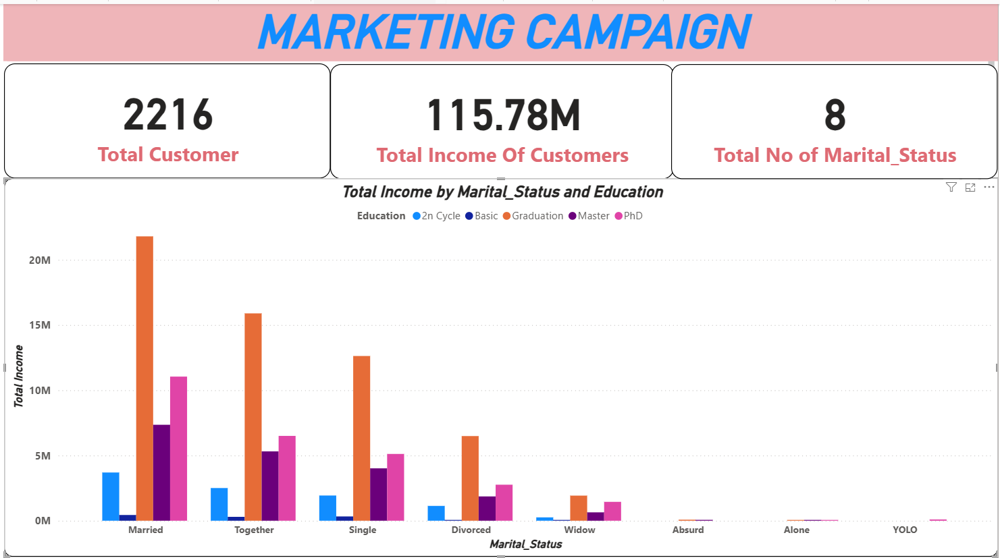

# Marketing Campaign Performance Analysis

## Executive Summary

This project analyzes marketing campaign performance to evaluate customer engagement, campaign effectiveness, and response behavior. Using campaign acceptance and response data, I identified high-performing campaigns, uncovered response drop-offs, and generated actionable insights to support data-driven marketing decisions. Interactive Power BI dashboards were developed to clearly communicate findings and business impact.

---

## Project Overview

Marketing teams need to understand which campaigns drive meaningful customer responses and where optimization is required. This project evaluates multiple marketing campaigns by analyzing acceptance rates, response trends, and customer engagement patterns across campaigns.

The goal is to translate raw marketing data into insights that can improve targeting strategies, campaign design, and overall return on investment (ROI).

---

## Key Objectives

* Evaluate marketing campaign effectiveness
* Analyze customer acceptance and response rates
* Identify high- and low-performing campaigns
* Present insights through clear, business-focused visualizations

---

## Tools & Technologies

* **Power BI** – Dashboard development and visualization
* **Python** – Data cleaning and preparation (if applicable)
* **Excel / CSV** – Source data format

---

## Data Description

The dataset contains customer-level information related to marketing campaigns, including:

* Campaign acceptance indicators (Campaign 1–5)
* Customer response behavior
* Campaign-related performance metrics
* Customer demographics and purchasing patterns

---

## Analysis Approach

1. Explored campaign acceptance and response distributions
2. Compared campaign performance across multiple metrics
3. Analyzed trends and patterns in customer engagement
4. Created calculated measures to summarize campaign effectiveness
5. Built interactive Power BI dashboards for insight communication

---

## Dashboards & Visualizations

### Campaign Acceptance Overview

### Campaign Response & Trends

### Overall Campaign Performance Summary

---

## Key Insights

* Campaign performance varies significantly across campaigns
* Some campaigns consistently outperform others in acceptance and response
* A noticeable drop-off exists between campaign acceptance and final response
* Data visualization enables faster identification of optimization opportunities

---

## Business Impact

* Supports data-driven marketing strategy decisions
* Helps prioritize high-performing campaigns
* Identifies areas to improve customer follow-through after acceptance
* Demonstrates how analytics can improve marketing ROI

---

## How to Run the Project

1. Clone this repository
2. Open the Power BI file (if included) or Jupyter Notebook
3. Explore the dashboards and insights

---

## Future Improvements

* Deeper customer segmentation analysis
* Predictive modeling for campaign response likelihood
* A/B testing framework for campaign optimization
* Automated reporting pipelines

---

## Contact

**Ernest Essel-Kaitoo**
📧 Email: [ernestekaitoo@gmail.com](mailto:ernestekaitoo@gmail.com)

Contributions, feedback, and collaboration opportunities are welcome.

---

